# **Project 1** - Providing Insights on Gun Voilence Data in America

## Participants
1. Sheela Srinivasa
2. Ben Crutchfield
3. Melody Yunchen Zhang
4. Kumar Siddharth


* The main purpose of the project is to provide insight to the gun voilence data using statistics and visualization methods available in Python and available packages like Pandas, matplotlib etc. The dataset was obtained from [http://www.kaggle.com ], but it was originally downloaded from [http://www.gunviolencearchive.org/ ]. The dataset contains records of more than 260k gun voilence incidents in the US between January 2013 and March 2018, inclusive. 

* Gun Violence Archive (GVA) is a not for profit corporation formed in 2013 to provide free online public access to accurate information about gun-related violence in the United States. 


## Import Dependencies


```python
import csv
import pandas as pd
import numpy as np
import matplotlib.pyplot as plt
%matplotlib inline
import seaborn as sns
from datetime import datetime
```

## Reading Data into a DataFrame and Checking Usability


```python
file = "../Dataset/gun-violence-data_01-2013_03-2018.csv"
df=pd.read_csv(file)
```


```python
df['gun_type'].head()
```


    0                       NaN
    1                       NaN
    2    0::Unknown||1::Unknown
    3                       NaN
    4    0::Handgun||1::Handgun
    Name: gun_type, dtype: object


```python
print(df.loc[0,'participant_age'])
print(df.loc[0,'participant_age_group'])
print(df.loc[0,'participant_gender'])
print(df.loc[0,'participant_relationship'])
print(df.loc[0,'participant_status'])
print(df.loc[0,'participant_type'])
print(df.loc[0,'gun_type'])
print(df.loc[0,'n_guns_involved'])
```

    0::20
    0::Adult 18+||1::Adult 18+||2::Adult 18+||3::Adult 18+||4::Adult 18+
    0::Male||1::Male||3::Male||4::Female
    nan
    0::Arrested||1::Injured||2::Injured||3::Injured||4::Injured
    0::Victim||1::Victim||2::Victim||3::Victim||4::Subject-Suspect
    nan
    nan
    


```python
df.info()
```

    <class 'pandas.core.frame.DataFrame'>
    RangeIndex: 239677 entries, 0 to 239676
    Data columns (total 29 columns):
    incident_id                    239677 non-null int64
    date                           239677 non-null object
    state                          239677 non-null object
    city_or_county                 239677 non-null object
    address                        223180 non-null object
    n_killed                       239677 non-null int64
    n_injured                      239677 non-null int64
    incident_url                   239677 non-null object
    source_url                     239209 non-null object
    incident_url_fields_missing    239677 non-null bool
    congressional_district         227733 non-null float64
    gun_stolen                     140179 non-null object
    gun_type                       140226 non-null object
    incident_characteristics       239351 non-null object
    latitude                       231754 non-null float64
    location_description           42089 non-null object
    longitude                      231754 non-null float64
    n_guns_involved                140226 non-null float64
    notes                          158660 non-null object
    participant_age                147379 non-null object
    participant_age_group          197558 non-null object
    participant_gender             203315 non-null object
    participant_name               117424 non-null object
    participant_relationship       15774 non-null object
    participant_status             212051 non-null object
    participant_type               214814 non-null object
    sources                        239068 non-null object
    state_house_district           200905 non-null float64
    state_senate_district          207342 non-null float64
    dtypes: bool(1), float64(6), int64(3), object(19)
    memory usage: 51.4+ MB
    

# Gun Voilence Incidents by State


```python
incidents_states=df['state'].value_counts()
type(incidents_states)
```


    pandas.core.series.Series


```python
incidents_states.head(20).plot(kind='bar',color='r',figsize=(20,8))
plt.ylabel('Number of Incidents',fontsize=18)
plt.title("Top States by Gun Voilence Incidents",fontsize=30)
plt.xticks(fontsize=14);plt.yticks(fontsize=12)
sns.set()
plt.savefig("Incidents_States")
```


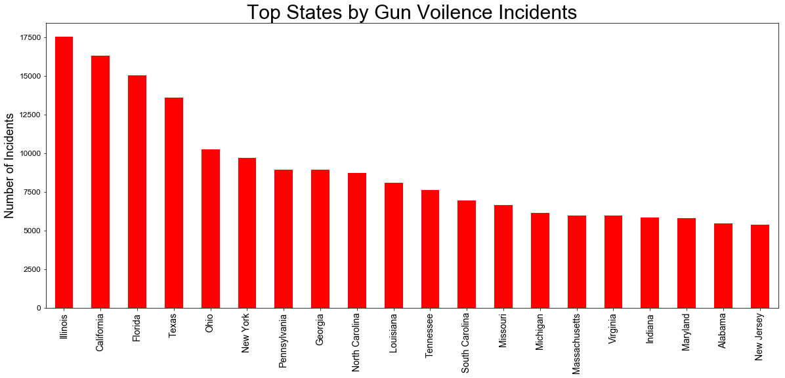


* State of Illinois tops the dreaded chart. Number of gun voilence incidents = 

* States of California and Florida stand second and third place respectively with Texas not a far off fourth place.

Note that we selected top 30 states (by reported incidents) for the above bar plot.

# Top Cities for Gun Voilence


```python
incidents_cities=df['city_or_county'].value_counts()

```


```python
incidents_cities.head(20).plot(kind='bar',color='b',figsize=(20,8))
plt.ylabel('Number of Incidents',fontsize=18)
plt.xticks(fontsize=14);plt.yticks(fontsize=12)
plt.title("Top Cities by Gun Voilence Incidents",fontsize=30)
plt.savefig("Incidents_Cities")
```


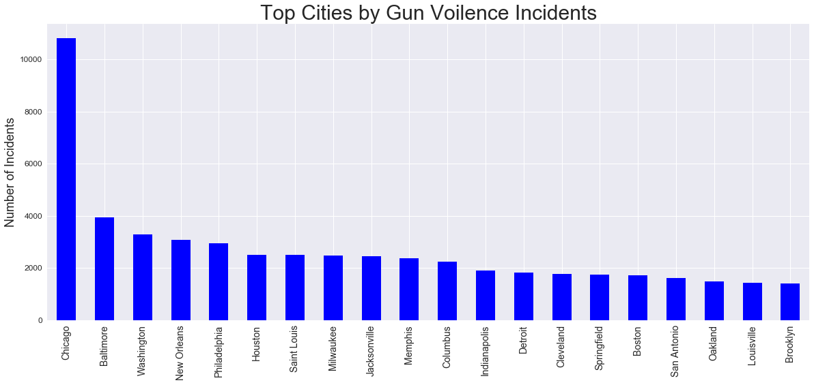


* As can be seen that Chicago takes first spot by large margin (almost three times of the second spot). Total incidents reported in Chicago from January 2013 to march 2018 are ...........
* Baltimore is a distant second with around 4000 incidents reported within that period.

# Number of Killed and Injured Statewise


```python
# help(pd.DataFrame.sort_values)
```


```python
grped_state = df.groupby('state')
state_agg = grped_state.agg(np.sum)
killed_injured = state_agg[["n_killed","n_injured"]]
killed_injured=killed_injured.sort_values(by='n_killed',ascending=False)
killed_injured.head()
```


<div>
<style scoped>
    .dataframe tbody tr th:only-of-type {
        vertical-align: middle;
    }

    .dataframe tbody tr th {
        vertical-align: top;
    }

    .dataframe thead th {
        text-align: right;
    }
</style>
<table border="1" class="dataframe">
  <thead>
    <tr style="text-align: right;">
      <th></th>
      <th>n_killed</th>
      <th>n_injured</th>
    </tr>
    <tr>
      <th>state</th>
      <th></th>
      <th></th>
    </tr>
  </thead>
  <tbody>
    <tr>
      <th>California</th>
      <td>5562</td>
      <td>7644</td>
    </tr>
    <tr>
      <th>Texas</th>
      <td>5046</td>
      <td>6106</td>
    </tr>
    <tr>
      <th>Florida</th>
      <td>3909</td>
      <td>7072</td>
    </tr>
    <tr>
      <th>Illinois</th>
      <td>3409</td>
      <td>13514</td>
    </tr>
    <tr>
      <th>Ohio</th>
      <td>2508</td>
      <td>5703</td>
    </tr>
  </tbody>
</table>
</div>


```python
killed_injured.head(20).plot(kind="bar",figsize=(20,8))
plt.ylabel('Number of Victims (Killed/Injured)',fontsize=18)
plt.xticks(fontsize=14);plt.yticks(fontsize=12)
plt.title("Top States by People Killed (and Injured) in Gun Voilence",fontsize=30)
plt.xlabel('')
plt.legend(fontsize=18)
plt.savefig("Victims_States")
```


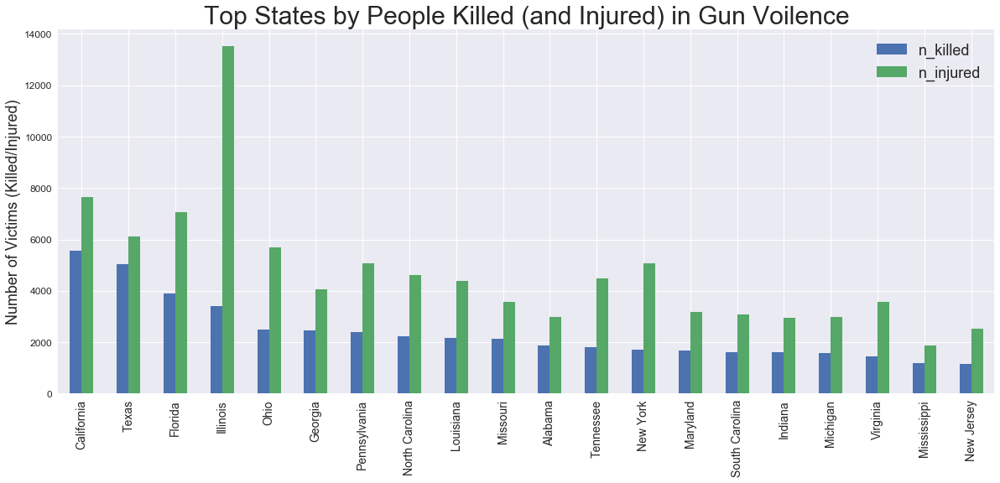


* State of California has the highest number of people killed in gun voilence.
* Texas is a close second in terms of fatalities.
* Although Illinois, has the highest number of gun related incidences, but the state does not tops the list of most fatalities. It comes fourth in terms of people killed, has high number of injured though.


# Number of People Killed and Injured Citywise


```python
grped_city = df.groupby('city_or_county')
grped_city_agg = grped_city.agg(np.sum)
victims_city = grped_city_agg[["n_killed","n_injured"]]
victims_city = victims_city.sort_values(by='n_killed',ascending=False)
victims_city.head()
```


<div>
<style scoped>
    .dataframe tbody tr th:only-of-type {
        vertical-align: middle;
    }

    .dataframe tbody tr th {
        vertical-align: top;
    }

    .dataframe thead th {
        text-align: right;
    }
</style>
<table border="1" class="dataframe">
  <thead>
    <tr style="text-align: right;">
      <th></th>
      <th>n_killed</th>
      <th>n_injured</th>
    </tr>
    <tr>
      <th>city_or_county</th>
      <th></th>
      <th></th>
    </tr>
  </thead>
  <tbody>
    <tr>
      <th>Chicago</th>
      <td>2104</td>
      <td>10427</td>
    </tr>
    <tr>
      <th>Houston</th>
      <td>1145</td>
      <td>1255</td>
    </tr>
    <tr>
      <th>Baltimore</th>
      <td>1055</td>
      <td>2427</td>
    </tr>
    <tr>
      <th>Saint Louis</th>
      <td>919</td>
      <td>1783</td>
    </tr>
    <tr>
      <th>Philadelphia</th>
      <td>901</td>
      <td>2326</td>
    </tr>
  </tbody>
</table>
</div>


```python
victims_city.head(20).plot(kind='bar',figsize=(20,8))
plt.ylabel('Number of Victims (Killed/Injured)',fontsize=18)
plt.xticks(fontsize=14);plt.yticks(fontsize=12)
plt.title("Top Cities/Counties by People Killed (and Injured) in Gun Voilence",fontsize=30)
plt.xlabel('')
plt.legend(fontsize=18)
plt.savefig("Incidents_Cities")
```


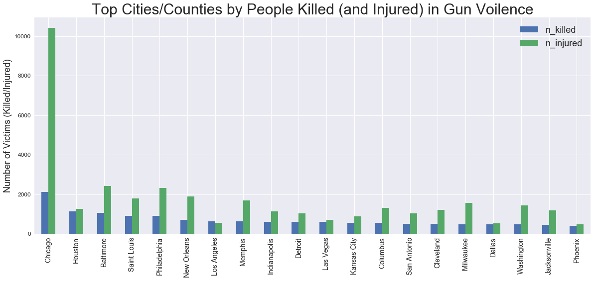


* City of Chicago clearly stands our. More than 50% of fatalities from gun voilence in state of Illinois happen in Chicago. Around 80% of injured in State of Illinois were injured in Chicago. 
* City of Houston accounts around 20% of all fatalities in state of texas.

# More Investigation of State of Texas

* Since we are in Texas, we went ahead for further investigation of the state in terms of gun voilence
* Lets study, gun fatalities and injuries by cities in Texas.


```python
# separate texas from grouped by state df
df_texas = grped_state.get_group('Texas')
grped_tex_city = df_texas.groupby('city_or_county')
tex_city_agg = grped_tex_city.agg(np.sum)
tex_city = tex_city_agg[['n_killed','n_injured']]
tex_city = tex_city.sort_values('n_killed',ascending=False)
tex_city.head()
```


<div>
<style scoped>
    .dataframe tbody tr th:only-of-type {
        vertical-align: middle;
    }

    .dataframe tbody tr th {
        vertical-align: top;
    }

    .dataframe thead th {
        text-align: right;
    }
</style>
<table border="1" class="dataframe">
  <thead>
    <tr style="text-align: right;">
      <th></th>
      <th>n_killed</th>
      <th>n_injured</th>
    </tr>
    <tr>
      <th>city_or_county</th>
      <th></th>
      <th></th>
    </tr>
  </thead>
  <tbody>
    <tr>
      <th>Houston</th>
      <td>1144</td>
      <td>1245</td>
    </tr>
    <tr>
      <th>San Antonio</th>
      <td>516</td>
      <td>1027</td>
    </tr>
    <tr>
      <th>Dallas</th>
      <td>465</td>
      <td>515</td>
    </tr>
    <tr>
      <th>Fort Worth</th>
      <td>223</td>
      <td>256</td>
    </tr>
    <tr>
      <th>Austin</th>
      <td>129</td>
      <td>196</td>
    </tr>
  </tbody>
</table>
</div>


```python
tex_city.head(20).plot(kind='bar',figsize=(20,8))
plt.ylabel('Number of Victims (Killed/Injured)',fontsize=18)
plt.xticks(fontsize=14);plt.yticks(fontsize=12)
plt.title("Top Cities/Counties in State of Texas by People Killed (and Injured) in Gun Voilence",fontsize=30)
plt.xlabel('')
plt.legend(fontsize=18)
plt.savefig("Incidents_Cities_Texas")
```


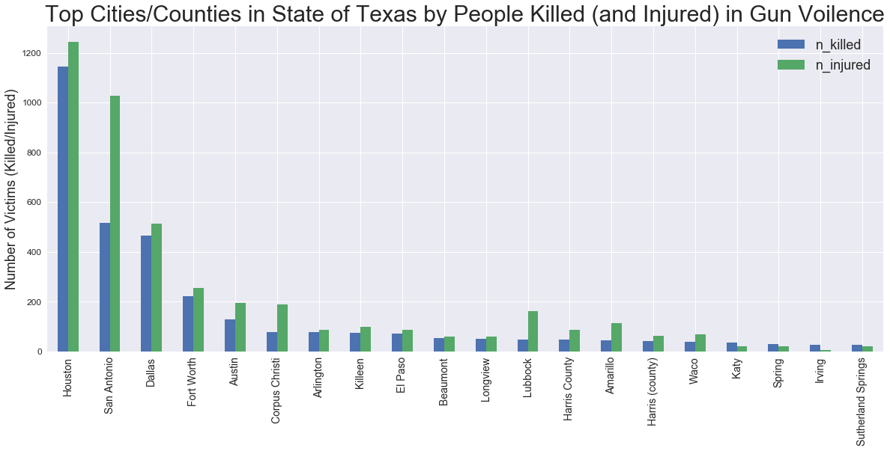


# Plots Involving Dates, Years of Incidences


```python
df_date=df[['date']]
```


```python
dayofmonth=[]
for index, row in df_date.iterrows():
    datesplit=row['date'].split('-')
    row['date']=datesplit[0]
#     dayofmonth.append(datesplit[1])
#     df_date.loc[index,'day of month']=datesplit[1]  #use .loc to add columns
#     df_date.loc[index,'day of week']=datesplit[2]
df_date.head()

```


<div>
<style scoped>
    .dataframe tbody tr th:only-of-type {
        vertical-align: middle;
    }

    .dataframe tbody tr th {
        vertical-align: top;
    }

    .dataframe thead th {
        text-align: right;
    }
</style>
<table border="1" class="dataframe">
  <thead>
    <tr style="text-align: right;">
      <th></th>
      <th>date</th>
    </tr>
  </thead>
  <tbody>
    <tr>
      <th>0</th>
      <td>2013</td>
    </tr>
    <tr>
      <th>1</th>
      <td>2013</td>
    </tr>
    <tr>
      <th>2</th>
      <td>2013</td>
    </tr>
    <tr>
      <th>3</th>
      <td>2013</td>
    </tr>
    <tr>
      <th>4</th>
      <td>2013</td>
    </tr>
  </tbody>
</table>
</div>


```python
df_year=(df_date['date'].value_counts()).to_frame()
# df_year.reset_index(drop=False)
df_year=df_year.rename(index={'2018': "2018 (3 Months Only)"})
df1_year=df_year.reindex(['2014','2015','2016','2017','2018 (3 Months Only)'])
df1_year
# df1.rename(index={1: 'a'})
```


<div>
<style scoped>
    .dataframe tbody tr th:only-of-type {
        vertical-align: middle;
    }

    .dataframe tbody tr th {
        vertical-align: top;
    }

    .dataframe thead th {
        text-align: right;
    }
</style>
<table border="1" class="dataframe">
  <thead>
    <tr style="text-align: right;">
      <th></th>
      <th>date</th>
    </tr>
  </thead>
  <tbody>
    <tr>
      <th>2014</th>
      <td>51854</td>
    </tr>
    <tr>
      <th>2015</th>
      <td>53579</td>
    </tr>
    <tr>
      <th>2016</th>
      <td>58763</td>
    </tr>
    <tr>
      <th>2017</th>
      <td>61401</td>
    </tr>
    <tr>
      <th>2018 (3 Months Only)</th>
      <td>13802</td>
    </tr>
  </tbody>
</table>
</div>


```python

df1_year.plot(kind="bar",legend=False, figsize=(20,8), color='b')
plt.ylabel('Number of Incidences')
plt.xticks(fontsize=14);plt.yticks(fontsize=12)
plt.title("Gun Violence Incidents in US by Year",fontsize=30)
plt.savefig("Incidents_Years")
```


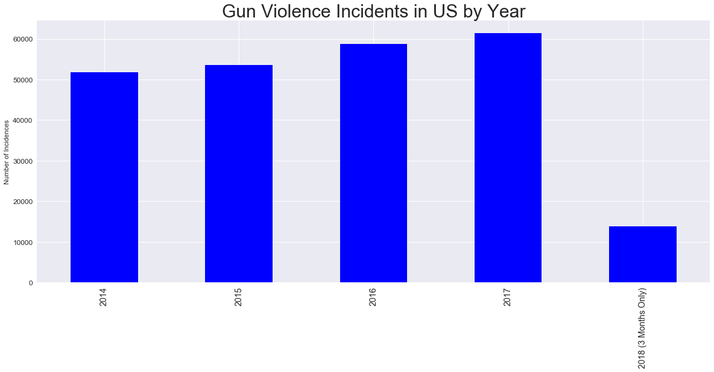


* There is a clear increase in gun voilence incidents for each year.
* Data plotted for 2018 is for three months only. 

# Relations to Gun Type


```python
cols_needed = ['n_killed','n_injured','gun_type','n_guns_involved']
df_guns = df[cols_needed].dropna(axis=0)
df_guns.head()
```


<div>
<style scoped>
    .dataframe tbody tr th:only-of-type {
        vertical-align: middle;
    }

    .dataframe tbody tr th {
        vertical-align: top;
    }

    .dataframe thead th {
        text-align: right;
    }
</style>
<table border="1" class="dataframe">
  <thead>
    <tr style="text-align: right;">
      <th></th>
      <th>n_killed</th>
      <th>n_injured</th>
      <th>gun_type</th>
      <th>n_guns_involved</th>
    </tr>
  </thead>
  <tbody>
    <tr>
      <th>2</th>
      <td>1</td>
      <td>3</td>
      <td>0::Unknown||1::Unknown</td>
      <td>2.0</td>
    </tr>
    <tr>
      <th>4</th>
      <td>2</td>
      <td>2</td>
      <td>0::Handgun||1::Handgun</td>
      <td>2.0</td>
    </tr>
    <tr>
      <th>6</th>
      <td>5</td>
      <td>0</td>
      <td>0::22 LR||1::223 Rem [AR-15]</td>
      <td>2.0</td>
    </tr>
    <tr>
      <th>10</th>
      <td>1</td>
      <td>3</td>
      <td>0::Unknown</td>
      <td>1.0</td>
    </tr>
    <tr>
      <th>11</th>
      <td>1</td>
      <td>3</td>
      <td>0::Unknown</td>
      <td>1.0</td>
    </tr>
  </tbody>
</table>
</div>


```python
gun_type={}
killed={}
injured={}
for index, row in df_guns.iterrows():
    firstsplit = row['gun_type'].split('|')
#     print(firstsplit)
    for element in firstsplit:
#         print(element)
        gun = element.split(':')[-1]
#         print(gun)
        if gun in gun_type:
            gun_type[gun]+=1
            killed[gun]+=row['n_killed']
            injured[gun]+=row['n_injured']
        else:
            gun_type[gun]=1
            killed[gun]=row['n_killed']
            injured[gun]=row['n_injured']
  
```


```python
guns_killinj = pd.DataFrame([gun_type,killed,injured])
# guns_killinj.rename(columns={0:"Guns Involved"})
guns_killinj=guns_killinj.drop(columns=['','Unknown'])
guns_killinj1=guns_killinj.transpose()
guns_killinj2=guns_killinj1.rename(columns={0:"Guns Involved", 1:"People Killed", 2:"People Injured"})
guns_killinj2=guns_killinj2.sort_values('Guns Involved', ascending=False)
guns_killinj2.head()
```


<div>
<style scoped>
    .dataframe tbody tr th:only-of-type {
        vertical-align: middle;
    }

    .dataframe tbody tr th {
        vertical-align: top;
    }

    .dataframe thead th {
        text-align: right;
    }
</style>
<table border="1" class="dataframe">
  <thead>
    <tr style="text-align: right;">
      <th></th>
      <th>Guns Involved</th>
      <th>People Killed</th>
      <th>People Injured</th>
    </tr>
  </thead>
  <tbody>
    <tr>
      <th>Handgun</th>
      <td>25050</td>
      <td>3304</td>
      <td>5700</td>
    </tr>
    <tr>
      <th>9mm</th>
      <td>6461</td>
      <td>844</td>
      <td>1241</td>
    </tr>
    <tr>
      <th>Rifle</th>
      <td>5271</td>
      <td>672</td>
      <td>882</td>
    </tr>
    <tr>
      <th>Shotgun</th>
      <td>4271</td>
      <td>662</td>
      <td>965</td>
    </tr>
    <tr>
      <th>22 LR</th>
      <td>3358</td>
      <td>386</td>
      <td>630</td>
    </tr>
  </tbody>
</table>
</div>


```python
guns_killinj2.index
```


    Index(['Handgun', '9mm', 'Rifle', 'Shotgun', '22 LR', '40 SW', '380 Auto',
           '45 Auto', '38 Spl', '223 Rem [AR-15]', '12 gauge', 'Other',
           '7.62 [AK-47]', '357 Mag', '25 Auto', '32 Auto', '20 gauge', '44 Mag',
           '30-30 Win', '410 gauge', '308 Win', '30-06 Spr', '10mm', '16 gauge',
           '300 Win', '28 gauge'],
          dtype='object')


```python
guns_k = guns_killinj2.rename(index={'9mm':'Handgun', '40 SW':'Handgun', '380 Auto':'Handgun',
       '45 Auto':'Handgun', '38 Spl':'Handgun', '357 Mag':'Handgun', '25 Auto':'Handgun', '32 Auto':'Handgun', '44 Mag':'Handgun',
       '10mm':'Handgun',
        '22 LR':'Rifle','30-30 Win':'Rifle','308 Win':'Rifle', '30-06 Spr':'Rifle', '300 Win':'Rifle',
        '12 gauge':'Shotgun', '20 gauge':'Shotgun', '410 gauge':'Shotgun','16 gauge':'Shotgun', '28 gauge':'Shotgun',
        '223 Rem [AR-15]':'Assault Rifles','7.62 [AK-47]':'Assault Rifles'
                                    })
guns_k=guns_k.reset_index(drop=False)
guns_k_grped = guns_k.groupby('index').agg(np.sum)
# guns_k_grped=guns_k_grped.drop("Other",axis=0)
guns_k_grped=guns_k_grped.sort_values('Guns Involved',ascending=False)
```


```python
fig,(ax1,ax2,ax3) = plt.subplots(nrows=3, ncols=1, sharex=True, figsize=(30,20))

guns_k_grped['Guns Involved'].plot(kind='bar', ax=ax1)
ax1.set_title('Type of Guns Involved', fontsize = 30)
# plt.yticks(fontsize=20)
guns_k_grped['People Killed'].plot(kind='bar', ax=ax2)
ax2.set_title('Number of People Killed by Gun Types', fontsize = 30)
guns_k_grped['People Injured'].plot(kind='bar', ax=ax3)
ax3.set_title('Number of People Injured by Gun Types', fontsize = 30)

ax1.tick_params(labelsize =20)
ax2.tick_params(labelsize =20)
ax3.tick_params(labelsize =20)

plt.tight_layout
plt.xticks(rotation=0,fontsize=30)
plt.xlabel('')
fig.get_tight_layout
# plt.yticks(fontsize=20)
plt.savefig("Incidents_guntypes")

```


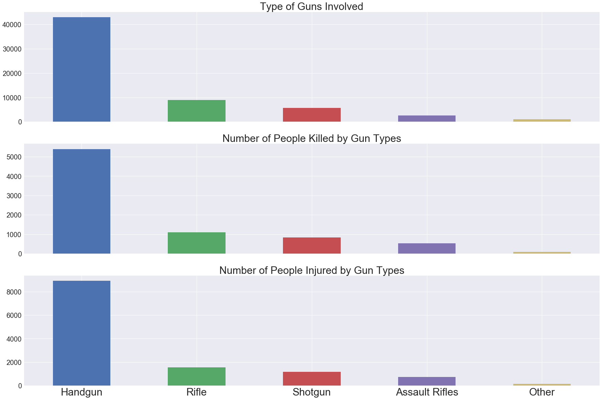


# Gun Types Analysis for Each Year


```python
print(df_date.head())
print(df[cols_needed].head())
```

       date
    0  2013
    1  2013
    2  2013
    3  2013
    4  2013
       n_killed  n_injured                gun_type  n_guns_involved
    0         0          4                     NaN              NaN
    1         1          3                     NaN              NaN
    2         1          3  0::Unknown||1::Unknown              2.0
    3         4          0                     NaN              NaN
    4         2          2  0::Handgun||1::Handgun              2.0
    


```python
df_guntype=df_date.join(df[cols_needed])
df_guntype=df_guntype.dropna(axis=0)
df_guntype.head()
```


<div>
<style scoped>
    .dataframe tbody tr th:only-of-type {
        vertical-align: middle;
    }

    .dataframe tbody tr th {
        vertical-align: top;
    }

    .dataframe thead th {
        text-align: right;
    }
</style>
<table border="1" class="dataframe">
  <thead>
    <tr style="text-align: right;">
      <th></th>
      <th>date</th>
      <th>n_killed</th>
      <th>n_injured</th>
      <th>gun_type</th>
      <th>n_guns_involved</th>
    </tr>
  </thead>
  <tbody>
    <tr>
      <th>2</th>
      <td>2013</td>
      <td>1</td>
      <td>3</td>
      <td>0::Unknown||1::Unknown</td>
      <td>2.0</td>
    </tr>
    <tr>
      <th>4</th>
      <td>2013</td>
      <td>2</td>
      <td>2</td>
      <td>0::Handgun||1::Handgun</td>
      <td>2.0</td>
    </tr>
    <tr>
      <th>6</th>
      <td>2013</td>
      <td>5</td>
      <td>0</td>
      <td>0::22 LR||1::223 Rem [AR-15]</td>
      <td>2.0</td>
    </tr>
    <tr>
      <th>10</th>
      <td>2013</td>
      <td>1</td>
      <td>3</td>
      <td>0::Unknown</td>
      <td>1.0</td>
    </tr>
    <tr>
      <th>11</th>
      <td>2013</td>
      <td>1</td>
      <td>3</td>
      <td>0::Unknown</td>
      <td>1.0</td>
    </tr>
  </tbody>
</table>
</div>


```python
def gun_type(df):
    gun_type={}
    killed={}
    injured={}
    for index, row in df.iterrows():
        firstsplit = row['gun_type'].split('|')
    #     print(firstsplit)
        for element in firstsplit:
    #         print(element)
            gun = element.split(':')[-1]
    #         print(gun)
            if gun in gun_type:
                gun_type[gun]+=1
                killed[gun]+=row['n_killed']
                injured[gun]+=row['n_injured']
            else:
                gun_type[gun]=1
                killed[gun]=row['n_killed']
                injured[gun]=row['n_injured']
    guns_killinj = pd.DataFrame([gun_type,killed,injured])
    # guns_killinj.rename(columns={0:"Guns Involved"})
    guns_killinj=guns_killinj.drop(columns=['','Unknown'])
    guns_killinj1=guns_killinj.transpose()
    guns_killinj2=guns_killinj1.rename(columns={0:"Guns Involved", 1:"People Killed", 2:"People Injured"})
    guns_killinj2=guns_killinj2.sort_values('Guns Involved', ascending=False)
#     guns_killinj2=guns_killinj2.transpose()
    guns_k = guns_killinj2.rename(index={'9mm':'Handgun', '40 SW':'Handgun', '380 Auto':'Handgun',
           '45 Auto':'Handgun', '38 Spl':'Handgun', '357 Mag':'Handgun', '25 Auto':'Handgun', '32 Auto':'Handgun', '44 Mag':'Handgun',
           '10mm':'Handgun',
            '22 LR':'Rifle','30-30 Win':'Rifle','308 Win':'Rifle', '30-06 Spr':'Rifle', '300 Win':'Rifle',
            '12 gauge':'Shotgun', '20 gauge':'Shotgun', '410 gauge':'Shotgun','16 gauge':'Shotgun', '28 gauge':'Shotgun',
            '223 Rem [AR-15]':'Assault Rifles','7.62 [AK-47]':'Assault Rifles'
                                        })
    guns_k=guns_k.reset_index(drop=False)
    guns_k_grped = guns_k.groupby('index').agg(np.sum)
    guns_k_grped=guns_k_grped.drop("Other",axis=0)
    guns_k_grped=guns_k_grped.sort_values('Guns Involved',ascending=False)
    return guns_k_grped
```


```python
grpd_guns=df_guntype.groupby('date')
df_2014=gun_type(grpd_guns.get_group('2014'))
df_2015=gun_type(grpd_guns.get_group('2015'))
df_2016=gun_type(grpd_guns.get_group('2016'))
df_2017=gun_type(grpd_guns.get_group('2017'))
df_2018=gun_type(grpd_guns.get_group('2018'))

```


```python
df_2017
```


<div>
<style scoped>
    .dataframe tbody tr th:only-of-type {
        vertical-align: middle;
    }

    .dataframe tbody tr th {
        vertical-align: top;
    }

    .dataframe thead th {
        text-align: right;
    }
</style>
<table border="1" class="dataframe">
  <thead>
    <tr style="text-align: right;">
      <th></th>
      <th>Guns Involved</th>
      <th>People Killed</th>
      <th>People Injured</th>
    </tr>
    <tr>
      <th>index</th>
      <th></th>
      <th></th>
      <th></th>
    </tr>
  </thead>
  <tbody>
    <tr>
      <th>Handgun</th>
      <td>12837</td>
      <td>1436</td>
      <td>2515</td>
    </tr>
    <tr>
      <th>Rifle</th>
      <td>2544</td>
      <td>342</td>
      <td>461</td>
    </tr>
    <tr>
      <th>Shotgun</th>
      <td>1720</td>
      <td>211</td>
      <td>326</td>
    </tr>
    <tr>
      <th>Assault Rifles</th>
      <td>864</td>
      <td>147</td>
      <td>202</td>
    </tr>
  </tbody>
</table>
</div>


```python
gun_t=df_2014.index.tolist()
gun_t
```


    ['Handgun', 'Rifle', 'Shotgun', 'Assault Rifles']


```python
x_axis=np.arange(len(df_2014))
# fig, ax = plt.subplots()
# df_2014.plot(kind='line',x=x_axis, y='Guns Involved',ax=ax,marker='o')
# df_2015.plot(kind='line',x=x_axis,y='Guns Involved',ax=ax,marker='*')
# df_2016.plot(kind='line',x=x_axis,y='Guns Involved',marker='^')
# df_2017.plot(kind='line',x=x_axis,y='Guns Involved',marker='<')
# df_2018.plot(kind='line',x=x_axis,y='Guns Involved',marker='>')
# plt.show()
# plt.show(ax)
gun_t=df_2014.index.tolist()
plt.plot(x_axis,df_2014['Guns Involved'],linewidth=1, alpha=0.9, label='2014')
plt.plot(x_axis,df_2015['Guns Involved'],linewidth=1, alpha=0.9, label='2015')
plt.plot(x_axis,df_2016['Guns Involved'],linewidth=1, alpha=0.9, label='2016')
plt.plot(x_axis,df_2017['Guns Involved'],linewidth=1, alpha=0.9, label='2017')
plt.plot(x_axis,df_2018['Guns Involved'],linewidth=2, alpha=0.9, label='2018')
plt.xticks(x_axis,gun_t)
plt.legend()
plt.Figure(figsize=(50,8))
```


    <Figure size 3600x576 with 0 Axes>


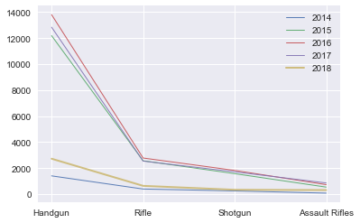


```python
gun_t=df_2014.index.tolist()
plt.plot(x_axis,df_2014['People Killed'],linewidth=1, alpha=0.9, label='2014')
plt.plot(x_axis,df_2015['People Killed'],linewidth=1, alpha=0.9, label='2015')
plt.plot(x_axis,df_2016['People Killed'],linewidth=1, alpha=0.9, label='2016')
plt.plot(x_axis,df_2017['People Killed'],linewidth=3, alpha=0.9, label='2017')
plt.plot(x_axis,df_2018['People Killed'],linewidth=1, alpha=0.9, label='2018')
plt.xticks(x_axis,gun_t)
plt.legend()
plt.Figure(figsize=(50,8))
```


    <Figure size 3600x576 with 0 Axes>


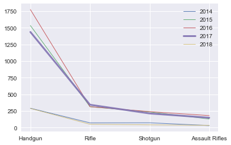


Curve (above) seems too cluttered hence not included


# Yearly Gun Type Data Barplots


```python
# function for yearly gun type data bar plot
def gun_type_yearly(df,year):
    fig,(ax1,ax2,ax3) = plt.subplots(nrows=3, ncols=1, sharex=True, figsize=(30,20))

    df['Guns Involved'].plot(kind='bar', ax=ax1)
    ax1.set_title(f'Type of Guns Involved in {year}', fontsize = 30)
    # plt.yticks(fontsize=20)
    df['People Killed'].plot(kind='bar', ax=ax2)
    ax2.set_title(f'Number of People Killed by Gun Types in {year}', fontsize = 30)
    df['People Injured'].plot(kind='bar', ax=ax3)
    ax3.set_title(f'Number of People Injured by Gun Types in {year}', fontsize = 30)

    ax1.tick_params(labelsize =20)
    ax2.tick_params(labelsize =20)
    ax3.tick_params(labelsize =20)

    plt.tight_layout
    plt.xticks(rotation=0,fontsize=30)
    plt.xlabel('')
    fig.get_tight_layout
    # plt.yticks(fontsize=20)
    plt.savefig(f"Incidents_guntypes_{year}.png")
    plt.show()
```


```python
# Make barplots for every year
gun_type_yearly(df_2014, '2014')
gun_type_yearly(df_2015, '2015')
gun_type_yearly(df_2016, '2016')
gun_type_yearly(df_2017, '2017')
gun_type_yearly(df_2018, '2018')

```


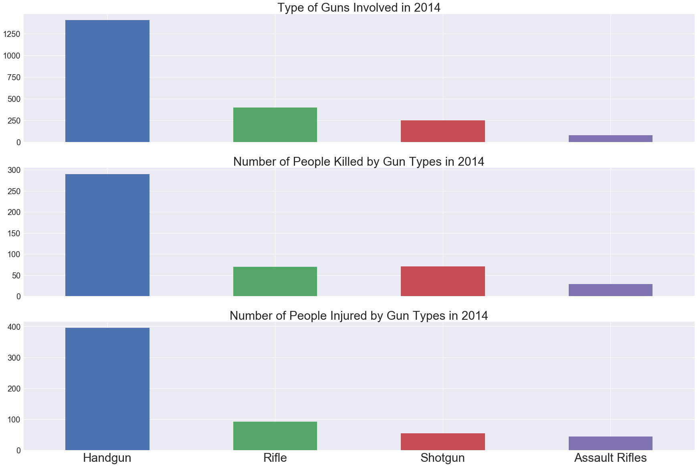


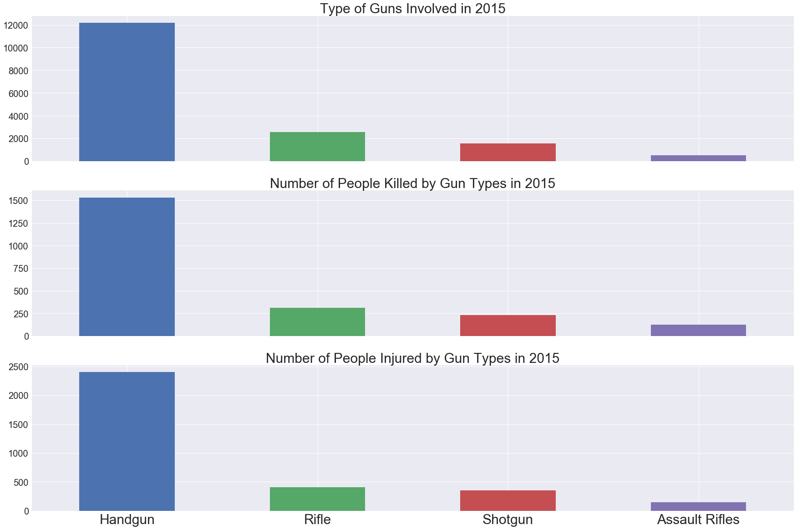


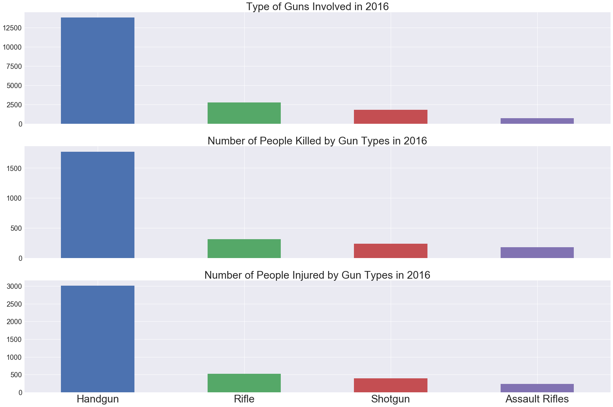


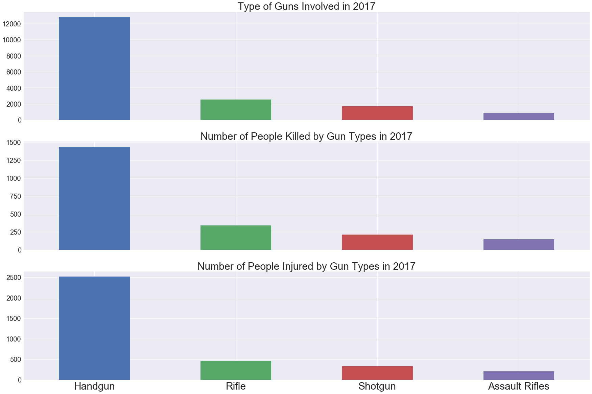


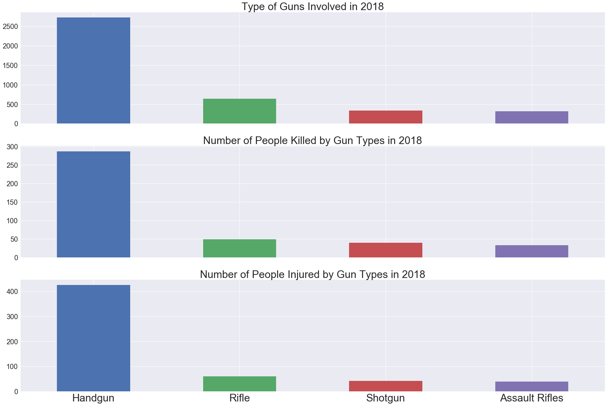


#### Curve (Above) not included in the presentation


```python
df_=pd.read_excel("../Dataset/Homicides_by_firearms.xls",sheet_name=2)
```


```python
df_.head()
```


<div>
<style scoped>
    .dataframe tbody tr th:only-of-type {
        vertical-align: middle;
    }

    .dataframe tbody tr th {
        vertical-align: top;
    }

    .dataframe thead th {
        text-align: right;
    }
</style>
<table border="1" class="dataframe">
  <thead>
    <tr style="text-align: right;">
      <th></th>
      <th>Country/Territory</th>
      <th>Variable</th>
      <th>1995</th>
      <th>1996</th>
      <th>1997</th>
      <th>1998</th>
      <th>1999</th>
      <th>2000</th>
      <th>2001</th>
      <th>2002</th>
      <th>2003</th>
      <th>2004</th>
      <th>2005</th>
      <th>2006</th>
      <th>2007</th>
      <th>2008</th>
      <th>2009</th>
      <th>2010</th>
    </tr>
  </thead>
  <tbody>
    <tr>
      <th>0</th>
      <td>Mauritius</td>
      <td>Homicide by firearm rate per 100,000 population</td>
      <td>NaN</td>
      <td>NaN</td>
      <td>NaN</td>
      <td>NaN</td>
      <td>NaN</td>
      <td>NaN</td>
      <td>NaN</td>
      <td>NaN</td>
      <td>NaN</td>
      <td>NaN</td>
      <td>0.000000</td>
      <td>0.100000</td>
      <td>NaN</td>
      <td>NaN</td>
      <td>NaN</td>
      <td>NaN</td>
    </tr>
    <tr>
      <th>1</th>
      <td>Uganda</td>
      <td>Homicide by firearm rate per 100,000 population</td>
      <td>NaN</td>
      <td>NaN</td>
      <td>NaN</td>
      <td>NaN</td>
      <td>NaN</td>
      <td>NaN</td>
      <td>NaN</td>
      <td>NaN</td>
      <td>1.257431</td>
      <td>1.337130</td>
      <td>NaN</td>
      <td>1.283612</td>
      <td>0.814110</td>
      <td>1.119996</td>
      <td>0.865054</td>
      <td>NaN</td>
    </tr>
    <tr>
      <th>2</th>
      <td>Zambia</td>
      <td>Homicide by firearm rate per 100,000 population</td>
      <td>NaN</td>
      <td>NaN</td>
      <td>NaN</td>
      <td>NaN</td>
      <td>NaN</td>
      <td>NaN</td>
      <td>NaN</td>
      <td>NaN</td>
      <td>NaN</td>
      <td>0.303419</td>
      <td>0.279557</td>
      <td>0.271160</td>
      <td>0.263019</td>
      <td>0.335683</td>
      <td>0.247446</td>
      <td>0.353677</td>
    </tr>
    <tr>
      <th>3</th>
      <td>Zimbabwe</td>
      <td>Homicide by firearm rate per 100,000 population</td>
      <td>NaN</td>
      <td>NaN</td>
      <td>NaN</td>
      <td>4.583362</td>
      <td>4.804423</td>
      <td>4.780376</td>
      <td>NaN</td>
      <td>NaN</td>
      <td>NaN</td>
      <td>NaN</td>
      <td>NaN</td>
      <td>NaN</td>
      <td>NaN</td>
      <td>NaN</td>
      <td>NaN</td>
      <td>NaN</td>
    </tr>
    <tr>
      <th>4</th>
      <td>Democratic Republic of the Congo</td>
      <td>Homicide by firearm rate per 100,000 population</td>
      <td>NaN</td>
      <td>NaN</td>
      <td>NaN</td>
      <td>NaN</td>
      <td>NaN</td>
      <td>NaN</td>
      <td>NaN</td>
      <td>NaN</td>
      <td>NaN</td>
      <td>0.982645</td>
      <td>1.014140</td>
      <td>0.925954</td>
      <td>1.121224</td>
      <td>0.799974</td>
      <td>1.089729</td>
      <td>1.562154</td>
    </tr>
  </tbody>
</table>
</div>


```python
df_2010 = df_[["Country/Territory", "2010"]]
df_2010.head()
```


<div>
<style scoped>
    .dataframe tbody tr th:only-of-type {
        vertical-align: middle;
    }

    .dataframe tbody tr th {
        vertical-align: top;
    }

    .dataframe thead th {
        text-align: right;
    }
</style>
<table border="1" class="dataframe">
  <thead>
    <tr style="text-align: right;">
      <th></th>
      <th>Country/Territory</th>
      <th>2010</th>
    </tr>
  </thead>
  <tbody>
    <tr>
      <th>0</th>
      <td>Mauritius</td>
      <td>NaN</td>
    </tr>
    <tr>
      <th>1</th>
      <td>Uganda</td>
      <td>NaN</td>
    </tr>
    <tr>
      <th>2</th>
      <td>Zambia</td>
      <td>0.353677</td>
    </tr>
    <tr>
      <th>3</th>
      <td>Zimbabwe</td>
      <td>NaN</td>
    </tr>
    <tr>
      <th>4</th>
      <td>Democratic Republic of the Congo</td>
      <td>1.562154</td>
    </tr>
  </tbody>
</table>
</div>


```python
df_2010 = df_2010.dropna(axis=0)
```

* 17 countries left


```python
df_2010.info()
```

    <class 'pandas.core.frame.DataFrame'>
    Int64Index: 17 entries, 2 to 107
    Data columns (total 2 columns):
    Country/Territory    17 non-null object
    2010                 17 non-null float64
    dtypes: float64(1), object(1)
    memory usage: 408.0+ bytes
    


```python
df_2010.head()
```


<div>
<style scoped>
    .dataframe tbody tr th:only-of-type {
        vertical-align: middle;
    }

    .dataframe tbody tr th {
        vertical-align: top;
    }

    .dataframe thead th {
        text-align: right;
    }
</style>
<table border="1" class="dataframe">
  <thead>
    <tr style="text-align: right;">
      <th></th>
      <th>Country/Territory</th>
      <th>2010</th>
    </tr>
  </thead>
  <tbody>
    <tr>
      <th>2</th>
      <td>Zambia</td>
      <td>0.353677</td>
    </tr>
    <tr>
      <th>4</th>
      <td>Democratic Republic of the Congo</td>
      <td>1.562154</td>
    </tr>
    <tr>
      <th>8</th>
      <td>Liberia</td>
      <td>0.425625</td>
    </tr>
    <tr>
      <th>14</th>
      <td>Dominican Republic</td>
      <td>16.298457</td>
    </tr>
    <tr>
      <th>15</th>
      <td>Grenada</td>
      <td>0.000000</td>
    </tr>
  </tbody>
</table>
</div>


```python
# df_2010=df_2010.sort_values('2010', ascending=True)
df_2010['number']=np.arange(len(df_2010))
df_2010.head()
```


<div>
<style scoped>
    .dataframe tbody tr th:only-of-type {
        vertical-align: middle;
    }

    .dataframe tbody tr th {
        vertical-align: top;
    }

    .dataframe thead th {
        text-align: right;
    }
</style>
<table border="1" class="dataframe">
  <thead>
    <tr style="text-align: right;">
      <th></th>
      <th>Country/Territory</th>
      <th>2010</th>
      <th>number</th>
    </tr>
  </thead>
  <tbody>
    <tr>
      <th>2</th>
      <td>Zambia</td>
      <td>0.353677</td>
      <td>0</td>
    </tr>
    <tr>
      <th>4</th>
      <td>Democratic Republic of the Congo</td>
      <td>1.562154</td>
      <td>1</td>
    </tr>
    <tr>
      <th>8</th>
      <td>Liberia</td>
      <td>0.425625</td>
      <td>2</td>
    </tr>
    <tr>
      <th>14</th>
      <td>Dominican Republic</td>
      <td>16.298457</td>
      <td>3</td>
    </tr>
    <tr>
      <th>15</th>
      <td>Grenada</td>
      <td>0.000000</td>
      <td>4</td>
    </tr>
  </tbody>
</table>
</div>


```python
#df_2010.set_index('Country/Territory')
fig,ax=plt.subplots()

for key, row in df_2010.iterrows():
    ax.scatter(row['number'], row['2010'], s=row['2010']*10,)
    ax.annotate(row['Country/Territory'], xy=(row['number'], row['2010']))
# df_2010.plot(kind="scatter",x="number", y="2010", edgecolor='black', color='green',s=75, ax=ax,)
plt.ylabel('Homicide by Firearm 2010 (per 100,000 Population)')
plt.xlabel('')
plt.figure(figsize=(50,25))
# fig, ax = plt.subplots()
# df[df['Country'] == 'Bhutan'].plot(x='Year', y='GDP_per_capita', ax=ax, legend=False)

# fig, ax = plt.subplots(facecolor='w')

# for key, row in df.iterrows():
#     ax.scatter(row['x'], row['y'], s=row['s']*5, alpha=.5)
#     ax.annotate(row['users'], xy=(row['x'], row['y']))


```


    <Figure size 3600x1800 with 0 Axes>


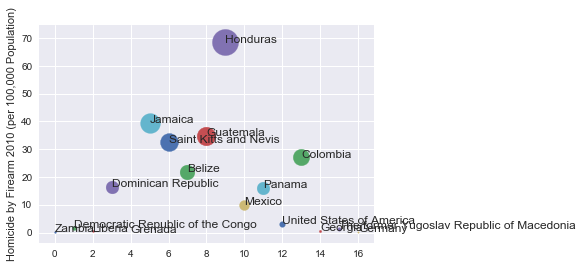


    <Figure size 3600x1800 with 0 Axes>


#### Curve not depicting any useful information about gun violence in USA so not included in the presentation
